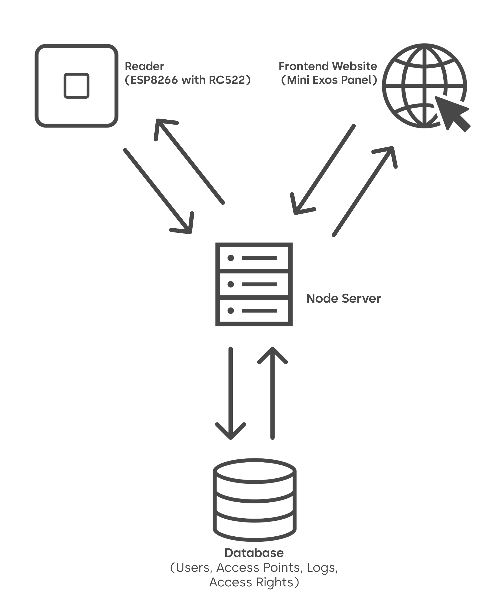
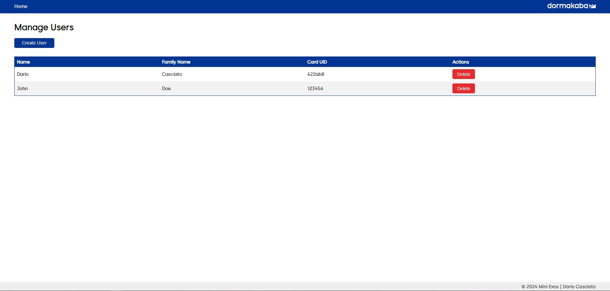
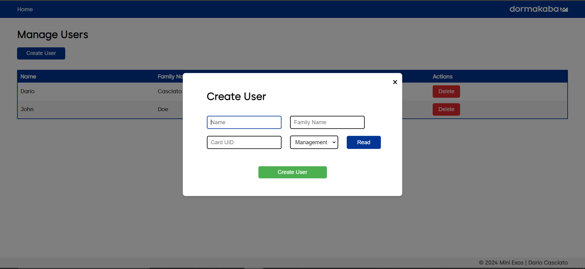
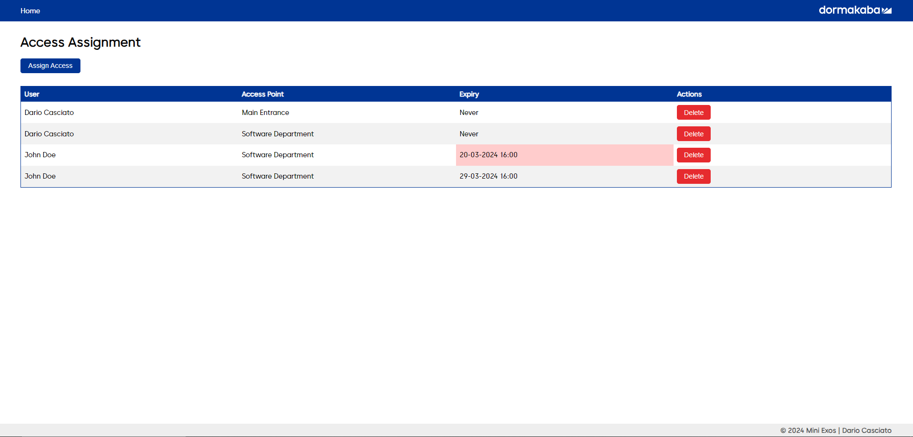
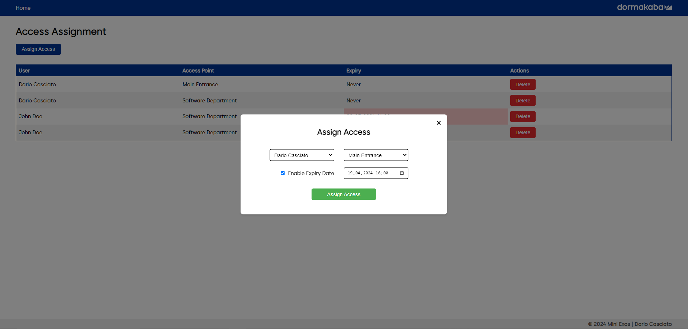
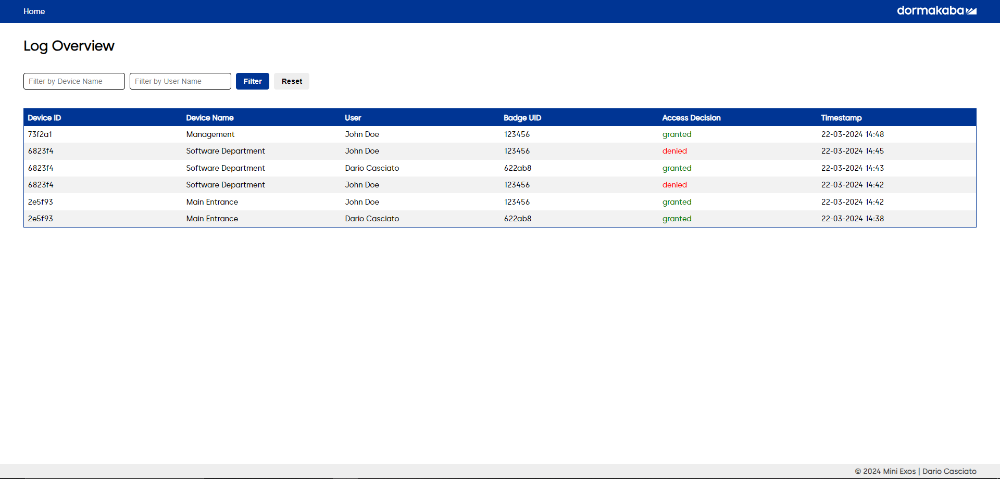

# Building an IoT Access Control App with ESP8266: A Journey

## Introduction
Welcome to one of my biggest projects yet! The **Mini-Exos**! The Mini-Exos is an Access Control System designed to manage and control access to secure areas or devices. It includes an interface for managing users, access points, access assignments, and logging access attempts. The system allows for real-time access requests from microcontrollers (specifically ESP8266 in this project) equipped with MFRC522 RFID reader, for a modern access control solution.

## Concept and Design
The Mini-Exos project is based on the access control [Exos 9300](https://www.dormakaba.com/ch-en/offering/products/electronic-access-data/access-control-solutions-for-corporate/kaba-exos-9300-base-system--ka_500000), which is far more complex and feature-rich. The Mini-Exos is a simplified version that was developed as a part of the new program of the trial internship at dormakaba Schweiz AG as a "GebäudeinformatikerIn EFZ" (Building Automation Engineer) in 2024. This project would give the intern a good understanding of the IoT and the access solutions offered by dormakaba.

The whole project is also based on the design guidelines of dormakaba. The User Experience and User Interface are designed to be simple and intuitive, with a focus on ease of use for the end-user.


## Software Architecture
The software architecture is rather simple. We have the reader (ESP8266) and the Frontend (Mini-Exos Webpanel) which the user can interact with. These are like the only "visible" parts of the system. The reader is responsible for reading an RFID Badge/Card and sending the data to the backend (Node Server).

The Webpanel is responsible for displaying the configurations and logs of the system. Everything that is displayed on the Webpanel is fetched from the Node Server. Also when changing or creating configurations, the Webpanel sends the data to the Node Server which then stores it in the database.

The Node Server is the "brain" of the system. It is responsible for handling the data from the reader and the Webpanel. It also stores the data in the database and sends the data to the Webpanel when requested. It also handles the access requests from the reader and sends the result if it is allowed or not back to the reader.


## User Interface

### Home Page
The Homepage gives you an overview of all the functionalities of the system. The navigation is held rather simple.


### Access Point Configuration Page
On this page, you can manage and configure existing or new access points. With the "Add Devices/Sync" button, the system will search for devices in the local network and list them to the user with the device ID and IP. If a device is found, the user can either add it directly to the system by also giving it a name, or the user can press the button "identify", which will make the found device light up to make it easier to identify it. When adding a device to the system, the node server sends its IP address to the device, so the device can now send its requests to the node server.

The existing devices are listed in a table with the name, description, IP address, the identify button, and a button to delete the device. The user can also edit the name and description of the device by clicking on the respective field in the table.


### User Management
The user management page is straightforward. It lists all the existing users in a table with the name, family name, and their Card UID. Every User that is created has also to be associated with a Card UID. Since we mostly don't know the UID of the card, we have the possibility to scan the card with a registered access point. The user can then select the access point and scan the card. The UID will then be displayed in the input field. The Access Point also signals when it is ready to scan a card.




### Access Assignment Page
Here is where the magic happens. The user can assign access rights to users for specific access points. The user can select a user from the dropdown menu, select an access point, and optionally even an expiration date. After the right is created, the user gets also listed in a table with the user, the access point, and the expiration date. From this moment on, the user can access the access point with its card.

Expired access rights are highlighted in red in the table.




### Log Overview Page
The log overview page is a simple page that lists all the access attempts in a table. The table shows the user, the access point, the result of the attempt, and the date. It also features a filter to filter the logs by user and access point.




## Microcontroller Functionality

An unregistered access point could be titled as "stupid": It doesn't know where to send the data to, so it sends it to nobody. and so it doesn't ever allow access.

But even registered access points don't do a lot of work. If it is registered, it just sends a payload to the node server and waits for a response. The Access Point ultimately acts as a bridge between the RFID reader and the Node Server. The code of the Access Point is rather simple and looks like the following:

```cpp

void stateIdle()
    {
        if(RFID::tagAvailable.getEdgePos()) // checks if a tag is available
        {
            Logging::log("\nTag detected! UID: %x", RFID::getUID());

            Logging::log("Requesting access...");

            // Send an access request to the server with the UID of the tag/card
            Access::ResponseStatus response = Access::request(String(RFID::getUID()));

            // Handle the response
            switch (response)
            {
            case Access::ResponseStatus::Ok:
                Logging::log("Access granted!");

                // Signal the user that the access is granted
                Signal::granted();
                break;

            case Access::ResponseStatus::Denied:
                Logging::log("Access denied!");
                Signal::denied();
                break;

            case Access::ResponseStatus::ConnectionFailed:
                Logging::log("Connection failed!");
                Signal::connectionError();
                break;

            case Access::ResponseStatus::ParseError:
                Logging::log("Parse error!");
                Signal::connectionError();
                break;
            }
        }

        // Handle host requests
        Host::handleClient(); // Check if the host has sent a request
    }

```

The Microcontroller basically is just sitting in this code snippet and waits for a tag to be scanned. If a Card/Badge is scanned, the following payload is sent to the Node Server:

```json
{
    "deviceId": "0x12345678",   // The ID of the Access Point
    "uid": "1a2b3c4d"           // The UID of the Card/Badge
}
```

With this information, the Node Server can now check if the user has access to the access point and send the result back to the Access Point.


## Security Measures
**WARNING**: The Mini-Exos is not designed to be safe against attacks. It is a simple project to learn about IoT and Access Control Systems. So it should only be used in a local network for educational purposes.

## Project Repository
The Project is stored on GitHub and is publicly available. You can find the repository here: [Mini-Exos](https://github.com/DarioCasciato/iot-access-controller). There is also a more detailed README file in the repository on how to set up the project.

## Conclusion
I think this was the most complex and educating project I have done so far. I learned a lot about IoT, Networks, API routes, and much more! I am very happy with the result and I hope you enjoyed reading about it! If you have any questions or feedback, feel free to comment below!