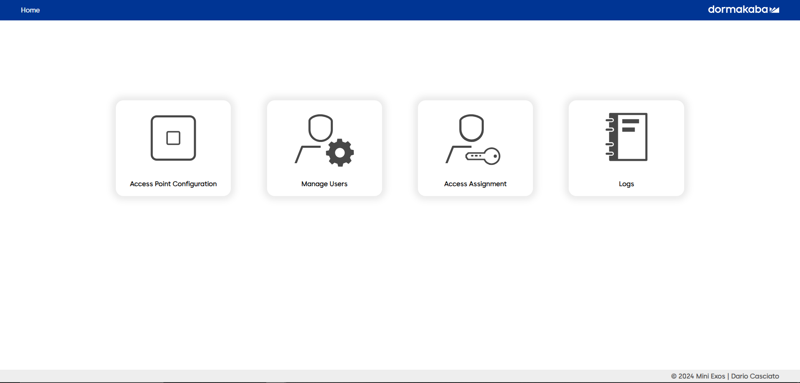

# IoT Access Control System (mini-Exos)

This project implements an Access Control System designed to manage and control access to secure areas or devices. It includes an interface for managing users, access points, access assignments, and logging access attempts. The system allows for real-time access requests from microcontrollers (specifically ESP8266 in this project) equipped with RFID readers, for a seamless access control solution.

<br>
This project was developed as a part of the new program of the trial internship at dormakaba Schweiz AG as a "GebäudeinformatikerIn EFZ" (Building Automation Engineer) in 2024. This project would give the intern a good understanding of the IoT and the access solutions offered by dormakaba.

## Overview Image



## Features

The Web Interface provides the following features:
- **User Management**: Create, update, and delete users.
- **Access Point Configuration**: Register and manage access points.
- **Access Assignments**: Assign access rights to users for specific access points, with optional expiry dates.
- **Logging**: Log all access attempts, including device, user, decision, and timestamp.
- **Real-time Access Requests**: Handle access requests sent from MCUs, checking against assigned access rights.

The Firmware for the ESP8266 microcontroller includes the following features:
- **RFID Reader**: Read RFID cards to identify users. (i used a Joy-It MFRC522)
- **Access Request**: Send access requests to the server for access validation. So the MCU does not have to store access rights locally.
- **Wi-Fi Connectivity**: Connect to the server over Wi-Fi to send access requests and receive responses.
- **Real-time Feedback**: Indicate access decisions with LEDs and a buzzer. (SK6812 LED & a generic Buzzer)
- **Host API**: The MCU can host an API to receive commands from the server to get its device ID and/or card UIDs for creating new users and requesting access.

## Getting Started

### Prerequisites

- Node.js (version 12 or later recommended)
- npm (usually comes with Node.js)

### Installation

1. Clone the repository:

   git clone https://github.com/DarioCasciato/iot-access-controller.git
   cd iot-access-controller

2. Install the necessary npm packages:
```bash
   npm install
```
3. Start the server:
```bash
   node server.js
```
The server should now be running and accessible at `http://localhost:3000`.

### Wiring

For the Wiring, please refer to the [hardware port definition](https://github.com/DarioCasciato/iot-access-controller/blob/main/access-point-firmware/src/hardware.h).

Used hardware in the project:
- ESP8266                          https://www.reichelt.com/ch/de/nodemcu-esp8266-wifi-modul-debo-jt-esp8266-p219900.html?&trstct=pos_1&nbc=1
- Joy-it MFRC522 RFID Reader       https://www.reichelt.com/ch/de/entwicklerboards-rfid-set-mit-rc522-rfid-modul-debo-rfid-set-p301408.html?&trstct=pos_1&nbc=1
- Generic Buzzer                   https://www.reichelt.com/ch/de/entwicklerboards-summer-passiv-debo-buzzer-p1-p282661.html?&trstct=pos_0&nbc=1
- SK6812 single LED                https://www.conrad.de/de/p/thomsen-led-5-rgb-sk-led-rgb-rgb-rund-5-mm-20-ma-6-v-1575784.html?refresh=true


### Configuration

- **Server IP**: Set your server's IP address in the MCU code to ensure it can communicate with the server. You can configure this in the `configurations.h` file.
- **Wi-Fi Credentials**: Set your Wi-Fi SSID and password in the MCU code to allow the device to connect to your network. You can configure this in the `espWiFi.cpp` file.
- **Wiring**: Connect the RFID reader, LEDs, and buzzer to the ESP8266 microcontroller. You can find the pin configurations in the `hardware.h` file.
- **Flash the Firmware**: Flash the firmware to the ESP8266 microcontroller using PlatformIO.

## Usage

- **Web Interface**: Navigate to `http://localhost:3000` to access the web interface for the overview of the system.
- **Configuring Access Points**: Add or update access points from the Access Point Config page. This is done automatically by clicking the "Scan for Devices" button.
- **Creating Users**: Go to the User Creation page to add new users by entering their name, family name, and card UID. The Card UID can be read from a registered Access Point to facilitate the process.
- **Assigning Access**: Use the Access Assignment page to grant users access to specific access points. You can also set an expiry date for the access rights.
- **Viewing Logs**: The Log Overview page displays all access attempts, including details like device name, user name, decision, and timestamp.

## API Endpoints

- `/api/users`: Manage users.
- `/api/access-points`: Configure access points.
- `/api/assignments`: Handle access assignments.
- `/api/logs`: Access logs of all access attempts.
- `/api/access-request`: Endpoint for MCUs to send access requests.

## Contributing

Contributions are welcome! Please feel free to submit pull requests or open issues to discuss proposed changes or enhancements.

## License

This project is licensed under the CC0 1.0 Universal License - see the [LICENSE](LICENSE) file for details.
